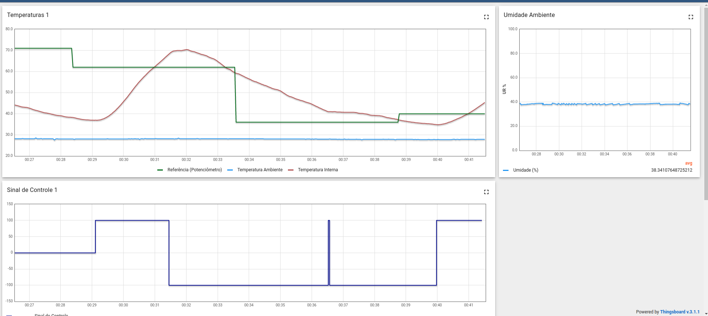
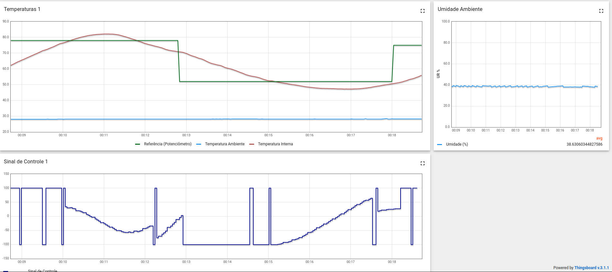

# FSE_Projeto1
 
## Objetivo
- Realizar o controle da temperatura de um sistema de forma automática utilizando os conhecimentos obtidos nas aulas de Fundamentos de sistemas embarcados da UnB.
- A temperatura do sistema é controlada a partir da lógica on/off e PID.
- O programa pode ser controlado tanto pela chave conectada no sistema quanto pelo terminal.
 
## Como iniciar
- Utilizar o seguinte comando na pasta raíz do programa:
```
make
```
- Após o programa ser compilado, executar o binário que foi gerado no diretório *bin*.
 
## Instruções
### Terminal
- Para trocar as lógicas de controle da temperatura utilize o comando:
```
   Ctrl + \
```
### Chave
- Para trocar as lógicas de controle da temperatura troque a posição da chave física que está conectada no sistema.
### Importante
- Para desligar o sistema de forma segura utilize o comando:
```
   Ctrl + c
```
## Funcionamento
### On/Off
- Exemplo do funcionamento do On/Off, em um intervalo de 15 minutos e com histerese de valor 5.


### PID
- Exemplo do funcionamento do PID, em um intervalo de 10 minutos.

